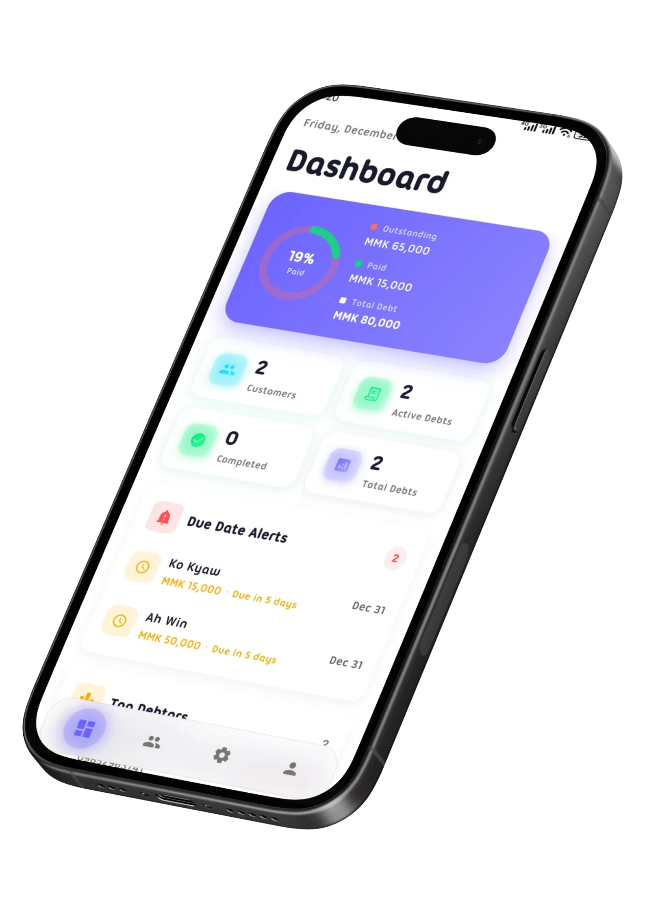

<div align="center">

<h1>AhKyaway Mhat</h1>
<p>
<strong>A beautiful, responsive debt tracking app for small businesses and communities.</strong>
</p>
<p>
<a href="#features">Features</a> &nbsp; • &nbsp;
<a href="#usage">Usage</a> &nbsp; • &nbsp;
<a href="#file-structure">Structure</a> &nbsp; • &nbsp;
<a href="#customization">Customization</a>
</p>


</div>

<br>

<div align="center">

</div>

<br>

## ✨ Features

<div align="center">

| 🎨 Modern Design | 🌙 Dark/Light Mode |
| :---: | :---: |
| Glassmorphism effects and smooth animations that feel premium. | Toggle with local storage persistence for user preference. |

| 🌐 Multilingual | 📱 Fully Responsive |
| :---: | :---: |
| English and Myanmar (မြန်မာ) support built-in. | Mobile-first design that looks great on all devices. |

</div>

## 🚀 Usage

### Local Development

1. Open `index.html` directly in browser.
2. Or use a local server:

```bash
# Using Python
python -m http.server 8000

# Using Node.js
npx serve .
```

### Updating Screenshots

Place landscape screenshots in the `screenshots/` folder. The app now supports **WebP** for better performance.

## 📂 File Structure

```
landing/
├── index.html        # Main HTML structure
├── styles.css        # All styles with dark/light themes
├── script.js         # Carousel, theme, device detection logic
├── translations.js   # EN/MM translations
├── assets/           # Icons and static assets
├── screenshots/      # App screenshots (WebP recommended)
└── README.md         # This file
```

## ⚙️ Customization

Edit CSS variables in `styles.css` to change the look and feel:

```css
:root {
    --primary: #6366F1;
    --accent: #38BDF8;
    /* ... */
}
```

## 📄 License

Distributed under the **MIT License**. See `LICENSE` for more information.

<br>

<div align="center">
<p><strong>© 2025 AhKyaway Mhat.</strong> Built with ❤️ by RyanWez.</p>
</div>
